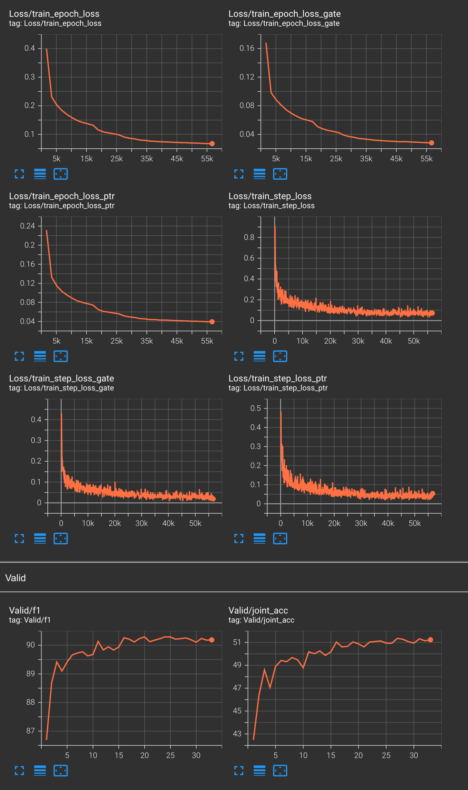

# Reproduction of TRADE

Paper: Transferable Multi-Domain State Generator for Task-Oriented Dialogue Systems, Chien-Sheng Wu, ACL 2019 [https://aclanthology.org/P19-1078/](https://aclanthology.org/P19-1078/)

Origin Code: [https://github.com/jasonwu0731/trade-dst](https://github.com/jasonwu0731/trade-dst)

Dataset: MultiWOZ 2.0 [https://github.com/budzianowski/multiwoz](https://github.com/budzianowski/multiwoz)

## Dependency

Python 3.9.6

```
pip install torch==1.9.0+cu111 -f https://download.pytorch.org/whl/torch_stable.html
pip install -r requirements.txt
```

## Prepare data

```
src/create_data.py

python src/clean_data.py data/dev_dials.json data/clean/valid.json
python src/clean_data.py data/train_dials.json data/clean/train.json
python src/clean_data.py data/test_dials.json data/clean/test.json
```

## Train

```
sh scripts/train.sh
```

## Test

```
sh scripts/test.sh
```

## Best results

In `results` directory

- Valid Joint ACC: 51.3651
- Test Joint ACC: 49.7828



## Problems

- \[Optimize\] Warming up: two schedulers conflict
- \[SpeedUp\] MultiGPU: NCCL error sometimes
- \[Reproduce\] Seed
- \[DataLoader\] num_workers>1 may lead to errors
- \[Precision\] Precision 16 may lear to loss NaN
